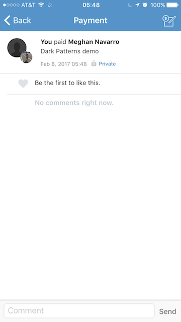
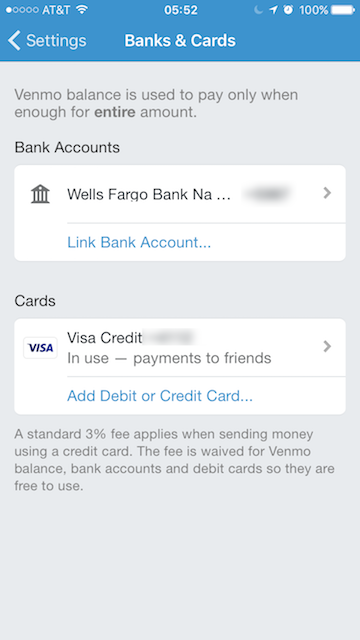

# Dark Patterns at Venmo

In this article, I want to highlight some of the evil deception going on at Venmo. I hope to shame Venmo into stopping their malicious design practices and prevent some of you from falling into the same trap that I did.

## Inspiration

If you haven't seen it yet, check out this talk by Harry Brignull called "Dark Patterns: User Interfaces Designed to Trick People". It's an enlightening discussion about how design, much like hacking, can be used for good and evil.

https://www.youtube.com/watch?v=1KVyFio8gw4

He launched a website [darkpatterns.org](http://darkpatterns.org/) to keep track companies that use evil design patterns and it might surprise you how many companies you might recognize.

## Deceptive Fees

If you're millenial, you probably use Venmo. It's one of the easiest way to tranfer money from one person to another. Here's how it works:

First, you go into the app and draft a new payment:

You select "PAY" and it then you get a confirmation button:

You select "PAY" again and you get this little loading screen:

And then you're dumped into this social feed of all your friend's payments. Looks like I paid Meghan Navarro $100. In the other tab, I can see just a list of my transactions and I see that payment is right there at the top.

I can click on the payment to see the details page which ironically gives me very little information about the payment. 

You see, Venmo is trying to be this social app kind of thing so my friends can actually comment on the transaction. It's pretty weird if you ask me, but it's fine. I don't know anyone who actually uses these social features.

So all if fine an dandy, but then you might notice some weird discrpancies on your credit card bill. And in fact, if you go online to view your transaction history, you'll notice that you've been charged a 3% fee.

But **I was never notified of this fee when making the payment**. Furthermore, **this fee is reflected nowhere within the app itself**. This primarily a mobile application -- few people who use Venmo ever even login online. So the fact that these fees are being charged without notifying you and aren't even being reflected in your transaction list is *pure evil*.

I contacted Venmo support with this issue and they notified me that I need to set up a bank account with the app to avoid these fees. So I went into the settings page within the app, and sure enough, I already have a bank account connected!

Note that there is a little disclaimer down there about the 3% fee. When I go to the details page for the card, you'll notice that it is selected as the means for refilling my account to make payments.

And when I go to the bank details page, I have to select this as the preferred payment method for refilling my account to make payments.

## Evil Design

So now I'm no longer being charged for transfering money. But the question is why isn't Venmo displaying the fees withing the application? Why aren't they confirming with you that you accept the fee when you're making a payment? And why aren't they pulling money out of your bank account by default, avoiding the fee entirely?

It's hard for me to refrain from a very cynical perspective here. But one thing is for sure -- this design is decieving their users into paying fees that they are entirely unaware of. I've been using Venmo for TODO years. I downloaded my entire venmo history and it turns out, I've paid a total of TODO in fees that I was completely unaware of!

The choice in design here has had HUGE consequences for me. Just check out this transaction and the amount of money was was *actually charged*.

All the while, these fees were completely avoidable! 

## Conclusion

As Harry Brignull mentioned in his talk, tech companies these days are very data-driven. They A/B test every design change and look at impacts on their analytics. So if they change their design to present a modal that confirms with the user the fee for their payment, or if they display the actual amount charged in the user's transaction list, do you think their conversion statistics are going to go up? Certainly not! But that's the point about *dark patterns* -- they're easy for a company to fall prey to.

I remain optimistic that Venmo is a great company full of good people who want to do the right thing. But their customer support has been entirely unhelpful or sympathetic. So here's my call to action: first, open up your Venmo settings and make sure you aren't getting charged that fee. If you are, you can go HERE to see how much you've paid in Venmo fees. You can go HERE to file a support ticket. Link to this article and quote how much you feel they owe you for their deception. And fill out this form HERE so we can join forces and hold them accountable to honest and transparent design. Discussion on Github.

266.4225